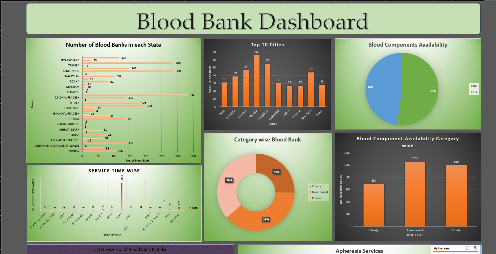

Blood Bank Data Analysis (Excel Dashboard)

## Project Overview
This project analyzes blood bank data to track donor details, blood availability, and demand.

## Tools Used
- Microsoft Excel
- Pivot Tables
- Charts
- Data Cleaning

## Key Insights
- Total donors by blood group
- Blood availability status
- City-wise donor distribution

## Dashboard Preview

## Conclusion
This project demonstrates my ability to clean, analyze, and visualize data using Excel and create an interactive dashboard to generate meaningful insights.
