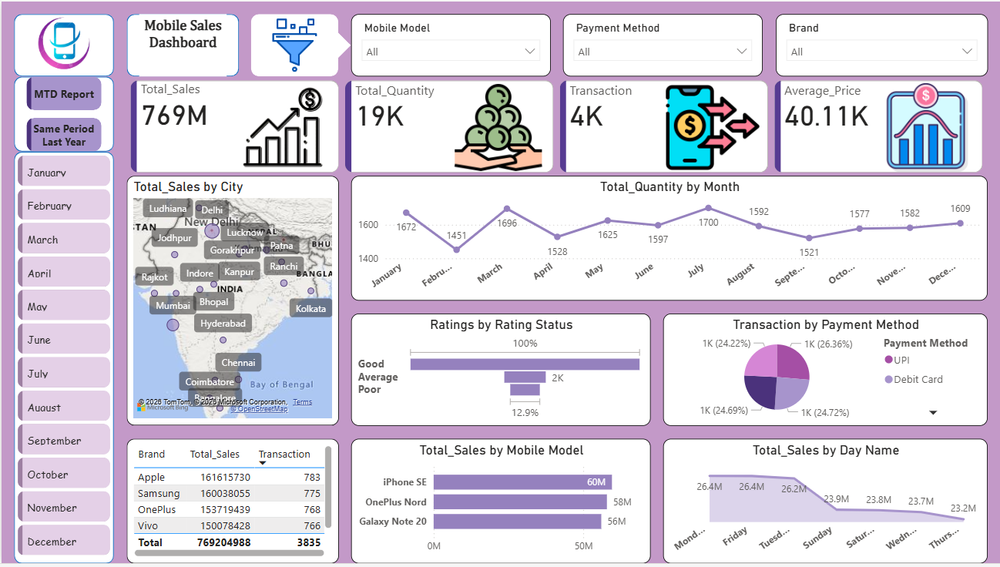
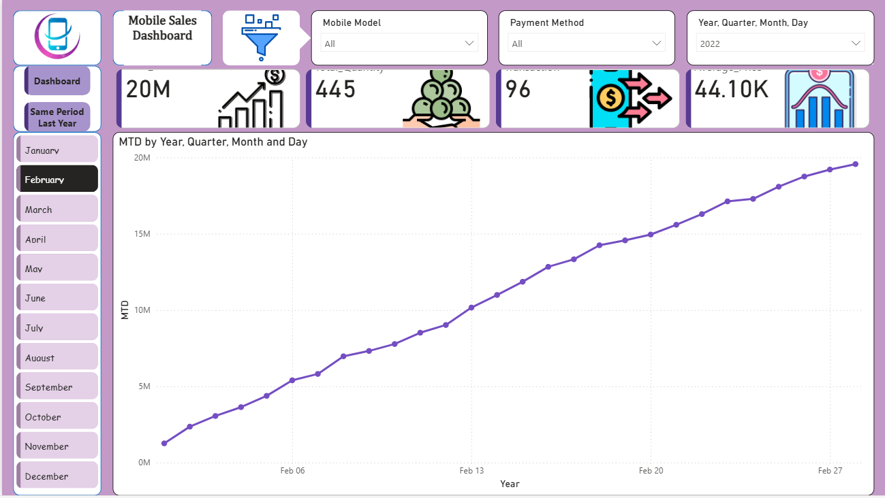
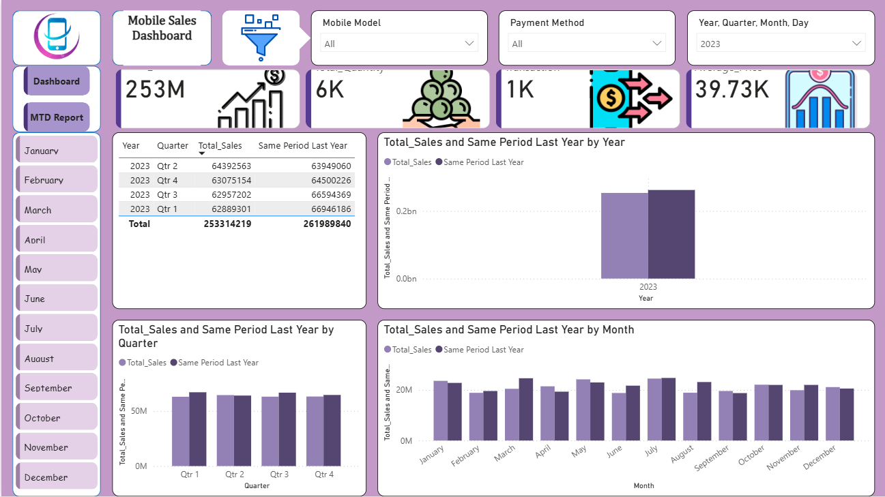

# Mobile Sales Dashboard Project

## Tools Used
- Power BI
- Excel

## Project Overview
This dashboard analyzes mobile sales performance across cities, brands, payment methods, and monthly trends.

## Dashboard Features
- Total Sales Analysis
- Quantity Analysis
- MTD Report
- Same Period Last Year Comparison
- Payment Method Insights
- Brand Performance

## Files Included
- Power BI Dashboard File (.pbix)
- Dataset (.xlsx)
- Dashboard Screenshots

## Dashboard Preview

### Main Dashboard

### MTD Dashboard

### Comparison Dashboard

