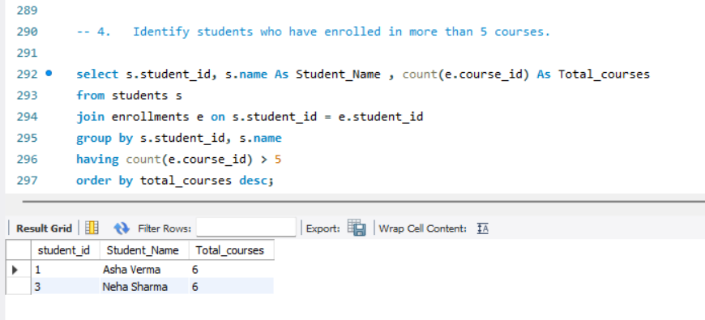
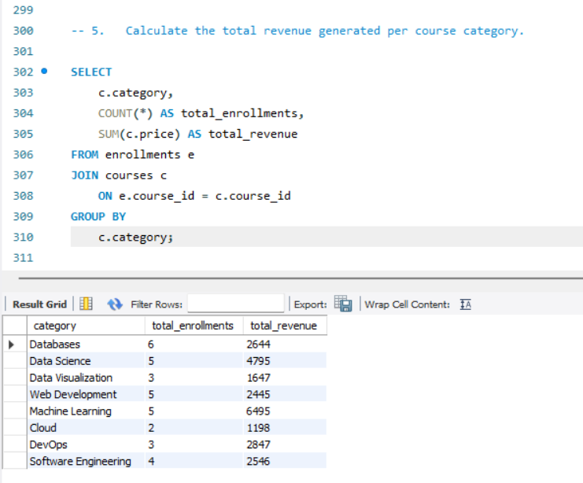

Online Learning Platform Data Analysis (SQL)

## Project Overview
This project analyzes an online learning platform database using SQL to extract meaningful insights about users, courses, and enrollments.

## Tools Used
- SQL
- Joins
- Aggregate Functions
- Subqueries
- Views

## Objectives
- Retrieve total number of users
- Analyze course enrollments
- Identify most popular courses
- Track user activity

## Key Insights
- Top performing courses based on enrollments
- Active vs inactive users
- Category-wise course distribution

## Sample Outputs

### Students Enrolled in More Than 5 Courses

### Revenue Generated per Course Category

## Conclusion
This project demonstrates my ability to write optimized SQL queries to analyze relational databases and generate business insights.
